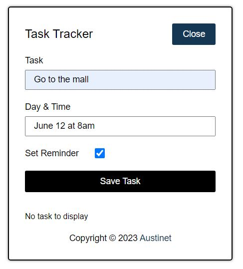
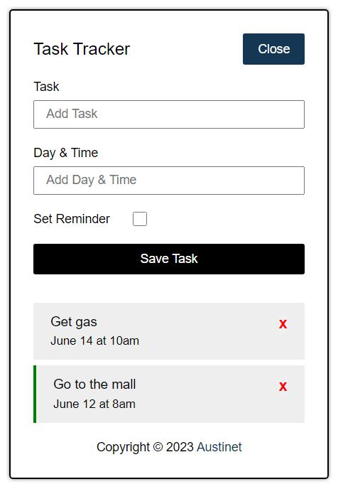
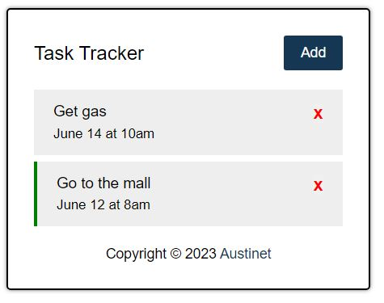

# Austinet - Task Tracker built with JavaScript

This is a task tracker application that manage tasks. Users can create, save and delete tasks, they can also set reminders. Tasks with reminders on are indicated with a green border by the left, users can also double click on tasks to toggle (set and unset) reminders.

## Table of contents

- [Overview](#overview)
  - [The challenge](#the-challenge)
  - [Screenshot](#screenshot)
  - [Links](#links)
- [My process](#my-process)
  - [Built with](#built-with)
  - [Continued development](#continued-development)
- [Author](#author)
- [Acknowledgments](#acknowledgments)

## Overview

### The challenge

Users should be able to:

- View the optimal layout for the site depending on their device's screen size
- Create, Save, and Delete tasks
- Set and unset reminders

### Screenshot

- 
- 
- 

### Links

- Solution URL: [Github Repository](https://github.com/Austinet/task-tracker-JS.git)
- Live Site URL: [Hosted Site](https://Austinet.github.io/task-tracker-JS)

## My process

### Built with

- Semantic HTML5 markup
- CSS custom properties
- Flexbox
- Desktop-first workflow
- Vanilla JavaScript
- Local Storage

### Continued development

Keep up the good work, keep practicing.

## Author

- Website - [Udhe Austine Ogaga](https://Austinet.github.io/portfolio/)
- LinkedIn - [Udhe Austine Ogaga](https://linkedin.com/in/udhe-austine-ogaga-25961820b)
- Frontend Mentor - [@Austinet](https://www.frontendmentor.io/profile/austinet)
- Twitter - [@austineudhe](https://www.twitter.com/austineudhe)

## Acknowledgments

Gratitute to God, Google, YouTube, and CTRL + Z.
